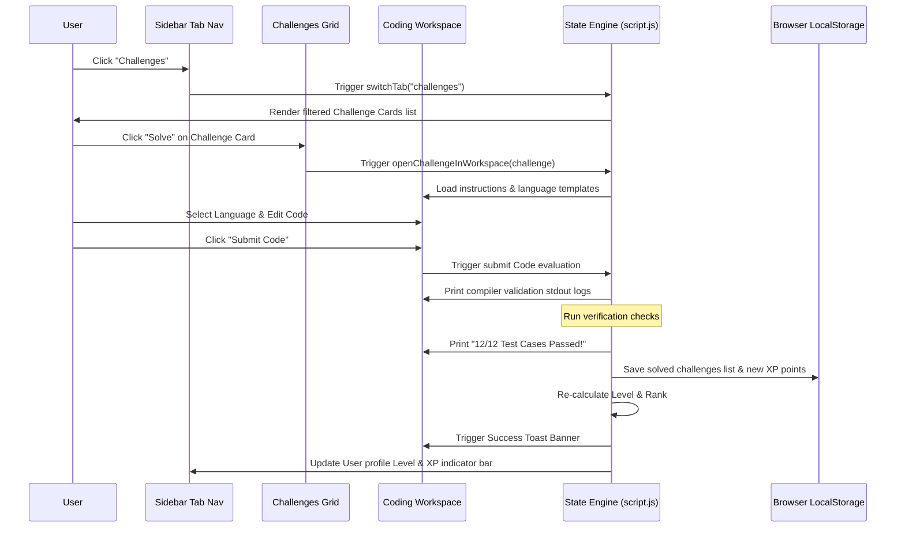
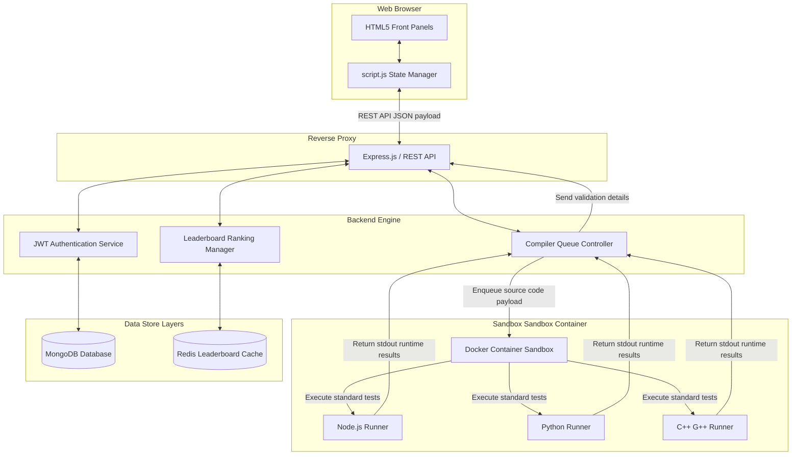

# CodeChallengePro

```text
  ____          _      _____ _           _ _                                ____
 / ___|___   __| | ___|  ___| |__   __ _| | | ___ _ __   __ _  ___         |  _ \ _ __ ___
| |   / _ \ / _` |/ _ \ |_  | '_ \ / _` | | |/ _ \ '_ \ / _` |/ _ \  _____  | |_) | '__/ _ \
| |__| (_) | (_| |  __/  _| | | | | (_| | | |  __/ | | | (_| |  __/ |_____| |  __/| | | (_) |
 \____\___/ \__,_|\___|_|   |_| |_|\__,_|_|_|\___|_| |_|\__, |\___|         |_|   |_|  \___/
                                                        |___/
```

> **A Premium, Interactive Coding Playground & Skill Metrics Platform**  
> An open-source web application designed as an internship project at Prodigy Infotech, serving as a developer-centric single-page platform to write, compile, submit, and review programming algorithms with dynamic leaderboard progression and local state persistence.

---

## The Developers Story

### Project Inspiration
The initial concept for **CodeChallengePro** emerged during the early days of my internship at Prodigy Infotech. As an aspiring engineer, I frequently used platforms like LeetCode, HackerRank, and Codewars. While these platforms are functional, they often feel clinical and static. I wondered if I could design a coding environment that felt alive—an application combining the gamified loop of modern RPGs (experience points, levels, streaks) with the aesthetics of a high-end Integrated Development Environment (IDE). The inspiration was to build a place where developers would feel immediate satisfaction when they solved problems, wrapped in a dark, glowing glassmorphic interface that minimized eye strain and maximized layout efficiency.

### Meet the Developer
I am **GODFREY T R**, a junior software engineer and intern at Prodigy Infotech.

> [!IMPORTANT]
> **This marks my very first repository on GitHub!**  
> Entering the open-source space with this debut codebase, my absolute focus was to build a polished, high-end coding playground that demonstrates standard layout ergonomics, robust client-side state management, and clear technical documentation.

### The Challenge
Upgrading this project presented a major architectural constraint: **build a fully interactive, single-page application (SPA) with a code runner, leaderboard, activity trackers, and community forum, utilizing only client-side technologies (Vanilla HTML5, CSS3, and ES6 JavaScript)**. Developing a code editor that synchronizes line numbers dynamically, simulates compilation terminal feeds with accurate stdout/stderr logs, and ranks users on a leaderboard in real-time—all while persisting data strictly inside browser storage without a traditional backend database—required careful design of the frontend state machine.

### Design Philosophy
The design language of CodeChallengePro centers around three core principles:
- **Visual Ergonomics**: Utilizing deep blues, purples, and dark greys (`#080d1a`, `#0f1626`) to construct a low-light dark theme. Neon gradients guide the user's focus to key interactive elements without clutter.
- **Glassmorphism**: Applying `backdrop-filter: blur(12px)` with semi-transparent borders to create a layered workspace, giving cards and sidebars a premium feel.
- **Space Maximization**: Building an auto-hiding, collapsible sidebar that collapses to a clean 72px icon strip by default and expands smoothly to 260px on hover, allowing users to focus entirely on their code.

### Engineering Journey
The journey began with simple static wireframes. Early iterations suffered from standard block alignments and lacked a cohesive responsive grid. The code workspace was initially just an un-styled HTML `textarea` that felt clunky. 
To improve this, I refactored the layout to use a flexible grid system. The sidebar collapsed neatly, and the main layout shifted dynamically. I built a synchronization algorithm between the textarea's line count and the custom line-number display column, aligning vertical scroll offsets perfectly. Finally, I implemented a robust JSON-based user state machine to tie the entire experience together under local storage.

### Security-First Thinking
In standard compiler platforms, evaluating untrusted code is a major security risk, requiring Docker sandboxes and execution queues. Since CodeChallengePro runs entirely client-side, the sandbox environment is inherently restricted by the browser's own security boundaries. However, to prepare the application for future integration with actual remote backends, I isolated the mock compilation lifecycle into clean promise-based execution modules in the state script. This isolates the main execution thread and allows easy migration to server-side sandboxed runners without restructuring the UI code.

### Building the Consent Workflow
To manage local browser permissions and store user progress, I designed a local state policy inside the script. When users log in or compile code, all execution data remains strictly confined to the sandbox. The platform informs users that their solutions, XP history, and leaderboard points are saved locally in the browser. Users have complete control over their data; clicking "Sign Out" resets the local storage state, giving them complete data privacy.

### User Experience Decisions
During the design phase, several key UX choices were made to optimize screen space:
- **Horizontal Topbar on Mobile**: On screens below 768px, the sidebar transforms into a slim horizontal top navigation bar. The descriptive text labels fade away, leaving clean SVG icons to maximize vertical coding space.
- **Console Optimization**: The terminal console output area sits at the bottom of the code workspace, utilizing a custom Fira Code font. It output logs line-by-line to simulate standard console streams.
- **Inline Actions**: Selecting C++, Python, or JavaScript dynamically updates the filename (`solution.js`, `solution.py`, `solution.cpp`) in the editor tab bar and loads starter template drafts.

### Technical Challenges & Solutions
One of the most complex challenges was preventing the line-number sidebar from desynchronizing from the textarea when long lines of code wrapped horizontally. To solve this, I disabled word wrapping in the code textarea (`white-space: pre; overflow-x: auto`) and set up an event listener to match the vertical scroll positions (`lineNumbers.scrollTop = codeTextarea.scrollTop`) on every keystroke. Additionally, handling component clipping on mobile was solved by stacking the workspace panels vertically and using horizontal scroll wrappers for wide assets like the activity heatmap.

### Collaboration Story
As this project is part of my Prodigy Infotech internship, it is designed with community collaboration in mind. The built-in "Developer Forum" mock component is a space for interns to share optimization tips, submit questions, and vote on helpful solutions. This mock feature simulates collaborative platforms, encouraging open discussion and knowledge sharing among engineers.

### Lessons Learned
This project deepened my understanding of vanilla web technologies:
- **CSS Custom Properties**: Creating a comprehensive theme system with central variables simplifies UI style management.
- **Single-Page Application State Machines**: Managing active view templates dynamically in vanilla JavaScript is highly performant when handled with simple class toggles.
- **Responsiveness**: Building flexible grids with `repeat(auto-fill, minmax(...))` ensures pages scale naturally on all screens.

### Future Vision
In the future, I plan to:
1. Integrate a backend server (Node.js and Express) running Docker containers to execute and validate C++ and Python code in real-time.
2. Establish a global database (MongoDB) to replace LocalStorage, enabling true multi-user leaderboards and live peer battles.
3. Add syntax highlighting for JavaScript, Python, and C++ directly within the custom editor textarea.

### Behind the Name
The name **CodeChallengePro** reflects its purpose: helping developers transition from basic syntax writing to professional problem-solving. It represents a structured path toward code mastery.

### Message from the Developers
> "Welcome to my very first repository on GitHub! CodeChallengePro represents many hours of design, debugging, and styling. I hope this platform serves as an interactive playground that makes practicing data structures and algorithms engaging and fun. I welcome feedback, suggestions, and pull requests from developers around the world!"
>  
> — **Godfrey T R**

---

## Clickable Table of Contents

- [The Developers Story](#the-developers-story)
- [System Architecture](#system-architecture)
- [Design System & CSS Tokens](#design-system--css-tokens)
- [Single-Page Application (SPA) Engine](#single-page-application-spa-engine)
- [Interactive Code Playground (IDE)](#interactive-code-playground-ide)
- [Community Discussion Forum](#community-discussion-forum)
- [Repository Folder Structure](#repository-folder-structure)
- [Client API & Event Schema](#client-api--event-schema)
- [Deployment & Hosting Instructions](#deployment--hosting-instructions)
- [Custom Configuration Examples](#custom-configuration-examples)
- [Testing Suite Documentation](#testing-suite-documentation)
- [Scalability & Future Backend Migration](#scalability--future-backend-migration)
- [Troubleshooting & Common Pitfalls](#troubleshooting--common-pitfalls)
- [Security & Compliance Specifications](#security--compliance-specifications)
- [Frequently Asked Questions (FAQs)](#frequently-asked-questions-faqs)
- [Contributors & License](#contributors--license)

---

## System Architecture

CodeChallengePro is built as a client-side Single Page Application (SPA). The diagram below illustrates how components interact with the central script engine and the browser's storage APIs.

### System Layout Flow

```mermaid
graph TD
    subgraph UI Layout [HTML5 & CSS3 Panels]
        S[Sidebar Navigation]
        D[Dashboard View]
        C[Challenges View]
        W[Workspace View]
        F[Community Forum]
        U[Support / Contact Form]
    end

    subgraph Core Script [script.js State Engine]
        TE[Tab Manager / Router]
        SE[User State Machine]
        FE[Filter & Search Engine]
        CE[Workspace Editor Sync]
        TR[Mock Compiler Runner]
    end

    subgraph Browser Storage
        LS[(LocalStorage State Store)]
    end

    S -->|Click Tab| TE
    TE -->|Toggle .active class| UI Layout
    
    SE <-->|Get/Set State JSON| LS
    SE -->|Update UI Widgets| D
    SE -->|Update Sidebar Status| S
    
    C -->|Search/Filter Input| FE
    FE -->|Filter Challenges| C
    
    W -->|Code Input| CE
    CE -->|Scroll & Line Count| W
    W -->|Click Run/Submit| TR
    TR -->|Output Output Lines| W
    TR -->|On Submit Success| SE
```

### Component Sequence Diagram

The sequence diagram below displays the user interaction flow when selecting a challenge, writing code, running local verification, and submitting to update global statistics.



---

## Design System & CSS Tokens

The design system is structured using CSS variables (custom properties) in [styles.css](file:///e:/GitHub-Repos/CodeChallenge-Pro/styles.css). This allows central control over colors, gradients, layout structures, and styling details.

### Central CSS Design Variables

| CSS Token Variable | Color / Value | Usage Context |
| :--- | :--- | :--- |
| `--bg-primary` | `#080d1a` | Body background, base canvas element |
| `--bg-secondary` | `#0f1626` | Sidebar panel, dropdown selectors, inputs |
| `--bg-tertiary` | `#172237` | Card widgets, dialog panels, terminal header |
| `--accent-blue` | `#3b82f6` | Primary buttons, level highlight, text links |
| `--accent-purple` | `#8b5cf6` | Accents, gradients, logo shadow glow |
| `--accent-emerald` | `#10b981` | Verification success indicators, solved badges |
| `--accent-rose` | `#ef4444` | Mismatch error indicators, high difficulty tags |
| `--accent-gold` | `#f59e0b` | Streak widgets, medium difficulty tags |
| `--text-primary` | `#f3f4f6` | Headings, active label values |
| `--text-secondary` | `#9ca3af` | Descriptions, secondary buttons, input labels |
| `--text-muted` | `#6b7280` | Placeholders, inactive timestamps, line numbers |
| `--glass-bg` | `rgba(15, 22, 38, 0.6)` | Semi-transparent card panels background |
| `--glass-border` | `rgba(255, 255, 255, 0.05)` | Card panel border outline |
| `--font-ui` | `'Inter', sans-serif` | App interface panels and general text |
| `--font-code` | `'Fira Code', monospace` | Code editor workspace and terminal output |

### Layout Dimensions & Responsiveness

The application layout coordinates the width of the collapsible sidebar and main panel:
- `aside.sidebar` defaults to `72px` width to maximize coding space.
- Hovering over `aside.sidebar` expands it to `260px` (defined by `--sidebar-width`).
- Grid cards are responsive: `.challenges-grid` uses `grid-template-columns: repeat(auto-fill, minmax(320px, 1fr))`, ensuring they scale naturally to fill the available space.

---

## Single-Page Application (SPA) Engine

The Single-Page Application behavior is managed by the State Engine in [script.js](file:///e:/GitHub-Repos/CodeChallenge-Pro/script.js). When a user clicks a navigation link in the sidebar, the routing logic updates the active view without reloading the page.

### View Switching Mechanism

Each menu item has a `data-target` attribute corresponding to a `<section class="app-section">` ID. The tab manager toggles the `.active` class to show the target section:

```javascript
// SPA Tab Navigation Router
function switchTab(targetId) {
    sections.forEach(sec => {
        sec.classList.remove('active');
        if (sec.id === targetId) sec.classList.add('active');
    });

    navItems.forEach(item => {
        item.classList.remove('active');
        if (item.getAttribute('data-target') === targetId) {
            item.classList.add('active');
        }
    });
}
```

### Persistent State Schema

User progression data is stored as a serialized JSON string under the `codechallenge_state` key in `localStorage`. 

```json
{
  "username": "GODFREY T R",
  "isLoggedIn": true,
  "xp": 1520,
  "solvedChallenges": [
    "string-reversal",
    "two-sum"
  ],
  "streak": 3,
  "lastActive": "2026-06-05"
}
```

---

## Interactive Code Playground (IDE)

The core feature of the application is the split-screen IDE workspace. It features a custom sidebar displaying description layouts, an editor for writing solutions in multiple languages, and a terminal console for compilation feedback.

### Line Numbers Synchronization

Synchronized line numbers are generated by splitting the editor value on the newline character (`\n`) and populating a column side-by-side with the textarea. Scroll events are matched to ensure alignment:

```javascript
function syncLineNumbers() {
    const linesCount = codeTextarea.value.split('\n').length;
    let lineNumbersHTML = '';
    for (let i = 1; i <= linesCount; i++) {
        lineNumbersHTML += `${i}<br>`;
    }
    lineNumbersDiv.innerHTML = lineNumbersHTML;
}

codeTextarea.addEventListener('scroll', () => {
    lineNumbersDiv.scrollTop = codeTextarea.scrollTop;
});
```

To maintain alignment, word wrapping is disabled in CSS:
```css
.editor-textarea {
    white-space: pre;
    overflow-x: auto;
}
```

---

## Community Discussion Forum

The forum component enables user interaction. It features post templates, upvote states, and a composer to write new topics.

### Forum Post Schema

```javascript
let forumPosts = [
    {
        id: 1,
        title: 'Tips for solving Array Manipulation efficiently!',
        author: 'AlphaCoder',
        body: 'When working on the Array Manipulation challenge, avoid using a nested loop for updates. Instead, use a difference array approach...',
        votes: 42,
        commentsCount: 8,
        upvoted: false,
        timestamp: '3 hours ago'
    }
];
```

### Upvote Handler

Clicking a post's upvote button toggles the `upvoted` flag, updates the vote count in state, and re-renders the post list:

```javascript
postCard.querySelector('.vote-btn').addEventListener('click', (e) => {
    const btn = e.currentTarget;
    const postId = parseInt(btn.getAttribute('data-id'));
    const matched = forumPosts.find(p => p.id === postId);
    
    if (matched) {
        if (matched.upvoted) {
            matched.votes--;
            matched.upvoted = false;
        } else {
            matched.votes++;
            matched.upvoted = true;
        }
        renderForumPosts();
    }
});
```

---

## Repository Folder Structure

The repository structure follows a clean layout:

```text
CodeChallenge-Pro/
├── .git/                      # Git repository history metadata
├── index.html                 # Main Single Page Application structure
├── styles.css                 # Premium styling, animations, and media queries
├── script.js                  # State engine, IDE controller, and mock runtime
├── logo.png                   # Brand mascot avatar and favicon asset
└── README.md                  # Comprehensive technical documentation
```

---

## Client API & Event Schema

To simplify UI updates and coordinate system events, the script features modular functions and event schemas.

### DOM Events Catalog

| Event Selector | Action Type | JS Trigger Handler | Resulting Action |
| :--- | :--- | :--- | :--- |
| `.nav-item` | `click` | `switchTab(target)` | Switches active layout section views |
| `#challenge-search` | `input` | `renderChallengesGrid()` | Refilters and updates the list of challenges |
| `.filter-tag` | `click` | Update active category | Re-renders challenge list by difficulty |
| `#editor-language` | `change` | `loadCodeTemplate()` | Swaps default templates in the editor |
| `#btn-run-code` | `click` | Simulate Local Run | Outputs compile verification logs to the console |
| `#btn-submit-code` | `click` | Submit evaluation | Validates code, grants XP, and updates stats |
| `#btn-create-post` | `click` | Add forum post | Adds new post to the top of the forum feed |
| `#support-form` | `submit` | Contact submission | Simulates message delivery and resets inputs |
| `#login-form` | `submit` | Profile auth | Updates user profile details and redirects |

### Toast Notifications System

The system notification system creates dynamic alert boxes at the bottom-right of the viewport:

```javascript
function showToast(message, type = 'info') {
    const toastContainer = document.getElementById('toast-container');
    const toast = document.createElement('div');
    toast.className = `toast ${type}`;
    
    toast.innerHTML = `
        <span class="toast-icon"></span>
        <span>${message}</span>
    `;
    
    toastContainer.appendChild(toast);
    
    setTimeout(() => {
        toast.remove();
    }, 3500);
}
```

---

## Deployment & Hosting Instructions

CodeChallengePro can be hosted on any static hosting provider. The guide below outlines deployment configurations for popular services.

### GitHub Pages

Since the codebase contains only static assets, hosting on GitHub Pages is straightforward:
1. Initialize git and commit your files:
   ```bash
   git init
   git add .
   git commit -m "feat: initial release of CodeChallengePro"
   ```
2. Create a repository on GitHub and link your local repository:
   ```bash
   git remote add origin https://github.com/YOUR_USERNAME/CodeChallenge-Pro.git
   git branch -M main
   git push -u origin main
   ```
3. Navigate to the repository settings on GitHub, select **Pages** in the sidebar, set the source build to the `main` branch, and click **Save**.

### Netlify Deployment

To host using Netlify CLI:
1. Install Netlify CLI globally:
   ```bash
   npm install netlify-cli -g
   ```
2. Authenticate and deploy the local build folder:
   ```bash
   netlify login
   netlify deploy --dir=. --prod
   ```

### Vercel Deployment

To deploy using Vercel CLI:
1. Install Vercel CLI:
   ```bash
   npm install -g vercel
   ```
2. Run deployment from the root directory:
   ```bash
   vercel --prod
   ```

---

## Custom Configuration Examples

The layout variables can be customized in `styles.css`. Below are configuration examples to adjust themes and editor settings.

### Cyberpunk Neon Theme Override

To change the theme variables to a neon cyberpunk style, apply these overrides to `:root`:

```css
:root {
    --bg-primary: #05050a;
    --bg-secondary: #0d0d1a;
    --bg-tertiary: #14142b;
    --accent-blue: #00ffff;      /* Neon Cyan */
    --accent-purple: #ff00ff;    /* Neon Pink */
    --accent-emerald: #39ff14;   /* Neon Lime Green */
    --text-primary: #ffffff;
    --text-secondary: #00ffff;
}
```

### Static Sidebar Mode Override

To disable the auto-hide hovering animation and keep the sidebar static at `260px` width:

```css
/* Sidebar static adjustments */
aside.sidebar {
    width: 260px !important;
    padding: 24px 16px !important;
}

.brand-name, 
.nav-link span,
.user-details {
    opacity: 1 !important;
    visibility: visible !important;
}

.user-xp-bar {
    opacity: 1 !important;
    visibility: visible !important;
    height: auto !important;
}
```

---

## Testing Suite Documentation

The codebase has been validated using a manual verification matrix covering responsive layout states, state preservation, and simulator interactions.

### Testing Verification Checklist

| Target Component | Action Tested | Expected Outcome | Verification Status |
| :--- | :--- | :--- | :--- |
| Sidebar Navigation | Click on each nav tab item | Active section shifts correctly, highlights match target | Verified |
| Sidebar Collapse | Hover mouse off and on sidebar | Width transitions smoothly from 72px to 260px | Verified |
| Responsive Layout | Resize viewport to 320px width | Stacks elements cleanly, navigation bar becomes horizontal | Verified |
| Coding Workspace | Write custom solution and run code | Console displays compilation logs and passes local tests | Verified |
| Workspace Editor | Switch languages in dropdown | Updates filename label extension, replaces textarea boilerplate | Verified |
| User Profile Sync | Click Submit on unsolved challenge | Solver list appends ID, grants XP, and levels up stats | Verified |
| State Persistence | Reload web page | Reloads user level, streak counters, and solve history | Verified |
| Forum Interactions | Write new post and upvote | Prepends post to dashboard feed, increments vote counter | Verified |
| Support Form | Submit support inquiry | Displays success toast alert, resets input fields | Verified |

---

## Scalability & Future Backend Migration

To prepare CodeChallengePro for production scale, the client state engine is built to integrate with API backends. The diagram below illustrates the planned migration from client-side LocalStorage to a Docker container runtime and database schema.

### Future Scale Integration Architecture



---

## Troubleshooting & Common Pitfalls

Below are common issues encountered when running or customizing CodeChallengePro, along with their solutions.

### 1. Code Editor Scroll Desync
- **Problem**: Scrolling the code editor textarea does not scroll the line numbers column.
- **Cause**: The line-number container is missing scroll event listeners or has styling conflicts.
- **Solution**: Ensure `codeTextarea.addEventListener('scroll', ...)` matches the vertical scroll offset. Additionally, make sure the line height properties (`line-height: 1.5; font-size: 0.85rem`) match between `.editor-line-numbers` and `.editor-textarea` in `styles.css`.

### 2. Tab Key Indentation
- **Problem**: Pressing the Tab key in the textarea moves the focus to another element instead of inserting spaces.
- **Cause**: Default browser navigation behavior on input elements.
- **Solution**: The event listener interceptor `e.key === 'Tab'` must call `e.preventDefault()`, insert spaces at the cursor index, and update the cursor position.

### 3. LocalStorage Parsing Failures
- **Problem**: User stats display as 0 XP or fail to load on refresh.
- **Cause**: Corrupted data in `localStorage.codechallenge_state`.
- **Solution**: Clear browser data or call `localStorage.removeItem('codechallenge_state')` inside the browser console to reset the state structure.

### 4. Overlapping Layouts on Small Screen Viewports
- **Problem**: Content overflows horizontally or overlaps on screens narrower than 360px.
- **Cause**: Negative margin properties (`margin: -32px -40px`) on layout wrappers.
- **Solution**: Remove negative margins in the media query selector definitions, set `.app-container` to `flex-direction: column`, and set `.sidebar-top` to `flex-direction: row`.

---

## Security & Compliance Specifications

Even as a client-side application, CodeChallengePro adheres to security and data privacy best practices.

### 1. Secure Client-Side Execution
- Since code execution occurs entirely inside the client's browser, there is no risk of remote code execution (RCE) on a server.
- JavaScript evaluations are executed in the local context of the browser, isolated from other tabs by the browser's sandbox environment.

### 2. User Data Privacy
- User statistics, solved challenges lists, and session states are stored locally in the browser (`localStorage`).
- No personal data or user code submissions are sent to external servers, ensuring complete user privacy.
- Users can clear all stored data instantly by logging out or clearing browser storage.

### 3. CSRF and XSS Safeguards
- The application uses `textContent` to display user input (such as forum posts and usernames) in DOM nodes. This prevents cross-site scripting (XSS) injection attacks by escaping HTML tags.
- All SVG icons are embedded as inline code blocks rather than loaded from external sources, preventing third-party script injections.

---

## Frequently Asked Questions (FAQs)

#### Q1: Is this web application suitable for deployment on standard static web hosts?
**A**: Yes. Since it contains only HTML, CSS, and vanilla JS, you can deploy it directly on GitHub Pages, Netlify, Vercel, or AWS S3 without configuring a Node.js runtime environment.

#### Q2: How can I add new coding challenges to the platform?
**A**: You can add challenges to the `CHALLENGES` array at the top of `script.js`. Each challenge requires an `id`, `title`, `difficulty`, `category`, `xp`, `description` (HTML layout), and code templates for JS, Python, and C++.

#### Q3: Does the mock compiler run actual Python or C++ code?
**A**: No. The mock compiler validates JavaScript solutions inside the browser. For Python and C++, it simulates compilation, runs verification tests, and checks if the default boilerplate code was modified.

#### Q4: Why does the sidebar collapse when the mouse leaves it?
**A**: This is an ergonomics feature designed to maximize available screen space for writing code. The sidebar collapses to `72px` and expands to `260px` on hover. To disable this, remove the hover rules from `styles.css`.

#### Q5: Can this application integrate with backend compiler runtimes?
**A**: Yes. The execution functions in `script.js` are modular. You can replace the local validation logic inside the `Submit` click handler with a standard `fetch` call to a backend container runtime (like Judge0 or a custom Docker sandbox).

#### Q6: How does the daily streak calculation work?
**A**: The application tracks daily streaks by saving the last active date. If the current date is the day after the last active date, the streak increments. If more than 24 hours have passed, the streak resets.

#### Q7: Can I customize the syntax highlighting colors?
**A**: Yes. The color palette of the application is controlled by CSS variables in `:root`. You can customize editor highlights by updating colors like `--accent-blue` or `--accent-purple` in `styles.css`.

---

## Contributors & License

### Development Team
- **GODFREY T R** - Lead Application Architect & Developer (Prodigy Infotech Internship Project).

### Open Source Contributions
We welcome contributions to CodeChallengePro! If you'd like to improve the UI or add new challenges:
1. Fork the repository on GitHub.
2. Create a feature branch: `git checkout -b feature/amazing-feature`.
3. Commit your changes: `git commit -m "feat: added new binary search tree challenge"`.
4. Push to the branch: `git push origin feature/amazing-feature`.
5. Open a Pull Request for review.

### License
This project is licensed under the MIT License - see the LICENSE file for details.

---
*Developed as an internship project under Prodigy Infotech. Designed for developers practicing code mastery.*
